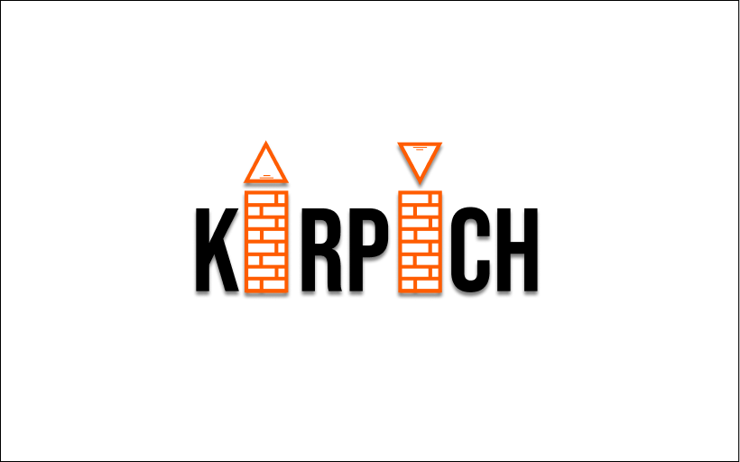
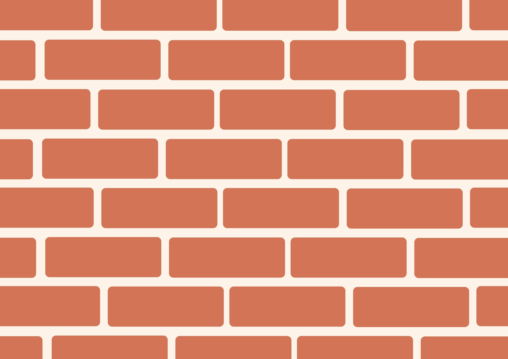

  

  
  

  # Kirpich Programming Language

## EN

### Introduction

>"Kirpich" is a simple programming language designed as a variation of the C language with custom-defined keywords and macros- It showcases the use of macros in C programming and demonstrates how a C-like language can be customized-

### Keywords

- `integer`: *Defines an integer data type.*
- `chisloSPlavayusheyTochkoy`: *Defines a floating-point number data type.*
- `simvol`: *Defines a character data type.*
- `nesigma`: *Defines an unsigned data type.*
- `sigma`: *Defines a signed data type.*
- `dliniy`: *Defines a long data type.*

### Macros

- `vivediStr(a)`: *Macro to print a string.*
- `vivediInt(a)`: *Macro to print an integer.*
- `vivediChar(a)`: *Macro to print a character.*
- `vivediUnsigned(a)`: *Macro to print an unsigned integer.*
- `vivediFloat(a)`: *Macro to print a floating-point number.*
- `endLn()`: *Macro to print a newline character.*

### Control Flow

- `loopSdelay(num)`: *Macro to create a loop that runs a specified number of times.*
- `dlya`: *Macro that acts as the for keyword.*
- `funcia`: *Keyword used to define a function.*
- `yesli`: *Keyword for conditional statements (if).*
- `inache`: *Keyword for the else part of a conditional statement (else).*
- `svecha(a)`: *Keyword for a switch statement using a character variable. (switch)*
- `keys`: *Used for defining cases in a switch statement. (case)*
- `poUmolchaniu`: *Used as the default case in a switch statement. (default)*

### Miscellaneous

- `slomay`: *Keyword for breaking out of a loop or a switch.*
- `tipadef`: *Keyword for defining custom data types.*
- `struktura`: *Keyword for defining a structure.*
- `vernir`: *Keyword for returning a value from a function.*
- `davay`: *Keyword for continuing to the next iteration in a loop.*

---
## RU

### Введение

>"kirpich" - это простой язык программирования, созданный как вариация языка C с пользовательскими определенными ключевыми словами и макросами. Целью является демонстрация использования макросов в программировании на C и пример того, как язык, подобный C, может быть настроен.

### Ключевые слова

- `integer`: *Определяет целочисленный тип данных.*
- `chisloSPlavayusheyTochkoy`: *Определяет тип данных числа с плавающей точкой.*
- `simvol`: *Определяет тип данных символа.*
- `nesgigma`: *Определяет беззнаковый тип данных.*
- `sigma`: *Определяет знаковый тип данных.*
- `dliniy`: *Определяет длинный тип данных.*

### Макросы

- `vivediStr(a)`: *Макрос для вывода строки.*
- `vivediInt(a)`: *Макрос для вывода целого числа.*
- `vivediChar(a)`: *Макрос для вывода символа.*
- `vivediUnsigned(a)`: Макрос для вывода беззнакового числа.*
- `vivediFloat(a)`: *Макрос для вывода числа с плавающей точкой.*
- `endLn()`: *Макрос для вывода символа новой строки.*

### Управление потоком

- `loopSdelay(count)`: *Макрос для создания цикла, который выполняется определенное количество раз.*
- `dlya`: *Макрос, действующий как ключевое слово "for".*
- `funcia`: *Ключевое слово для определения функции.*

- `yesli`: *Ключевое слово для условных операторов (if).*
- `inache`: *Ключевое слово для второй части условного оператора (else).*

- `svecha(a)`: *Ключевое слово для оператора переключения с использованием переменной символа. (switch)*
- `keys`: *Используется для определения случаев в операторе переключения. (case)*
- `poUmolchaniu`: *Используется в качестве случая по умолчанию в операторе переключения. (default)*

---

### Разное

- `slomay`: *Ключевое слово для выхода из цикла или оператора переключения.*

- `tipadef`: *Ключевое слово для определения пользовательских типов данных.*
- `struktura`: *Ключевое слово для определения структуры.*

- `verni`: *Ключевое слово для возвращения значения из функции.*
- `davay`: *Ключевое слово для продолжения на следующую итерацию в цикле.*

  
